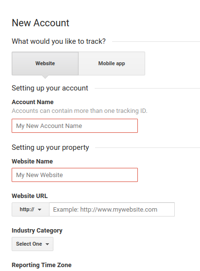

Integrating Google Analytics into your blog is pretty easy and straight forward. It will help you to track and report your website traffic.

### Sign Up

Go to [https://analytics.google.com](https://analytics.google.com) to sign up and start using Google Analytics. You will have to fill up a small form as shown below.

Submitting this form will help you obtain a new Tracking ID for your website or blog.

### Global Site Tag

You need to also add the Global Site Tag (gtag.js) tracking code into the `<HEAD>` section of every web-page that you need to track. To obtain your Global Site Tag code, go to your GA Admin dashboard and under _Property Settings_, look for `Tracking Info > Tracking Code`.

### Jekyll and Github-Pages

If you are using jekyll and github pages, you might already have the Global Site Tag integrated into your base templates. Hence all you need to update is the `_config.yml` file by including your Tracking ID value into the configuration field named as `google_analytics`.
