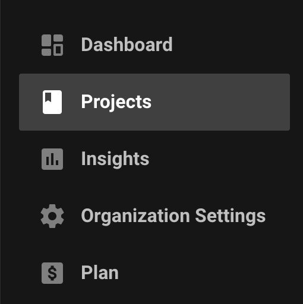
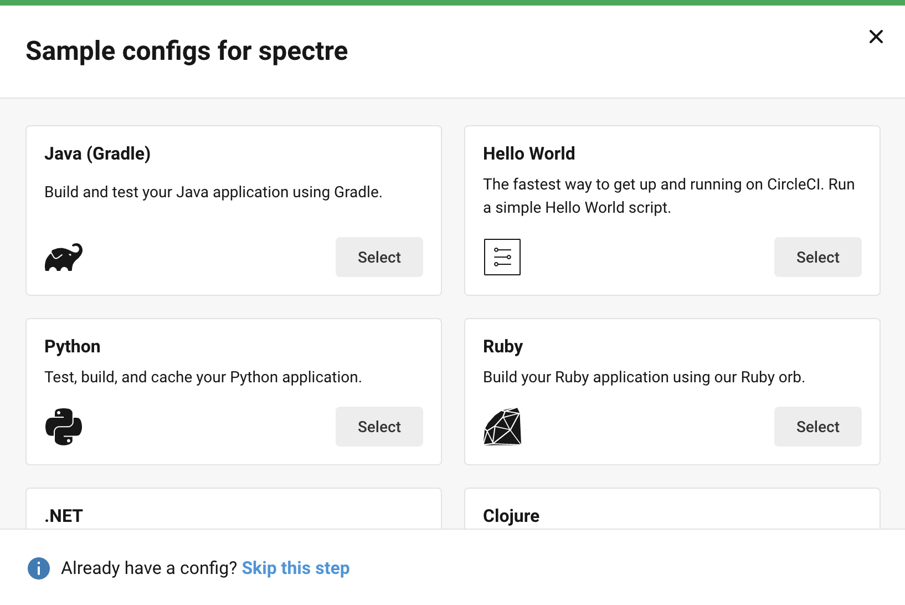

If you are already familiar with other CI tools like Jenkins or GitlabCI, then transitioning to CircleCI would be very easy and straight forward. However, if you are new to CI and its related tools in general, the following steps will help you get started.

But first, if you are new to CI/CD, you must know or at least understand the basic difference between Continuous Integration vs Continuous Delivery vs Continuous Deployment. These terms are often used and understanding their deferences can help you a lot. Atlassian has a very good article written on this and I encourage you to read it [here](https://www.atlassian.com/continuous-delivery/principles/continuous-integration-vs-delivery-vs-deployment).

### Common terminologies in CircleCI

1. `Projects:` A project in circleCI corresponds to the same project or repository in your Github or BitBucket. It even shares the same name as your code repository.
2. `Pipelines:` A pipeline is a set of stages that are carried out in order to build or deploy a project.
3. `Orbs:` Orbs are some reusable snippets of code for automation. They helps us to integrate our project with other third party tools.
4. `Jobs:` Jobs are basically a collection of `Steps`. Each job must declare an executor which can be a docker image or a machine virtual image.
5. `Steps:` Steps are a set of actions taken to complete a job. It can be used to run various commands or scripts.
6. `Workflows:` A workflow defines the list of jobs and their execution order. Jobs can be configured to run in parallel(default behavior) or sequential.

### Basic project setup

First thing to do would be to have your project ready in Github or BitBucket. Once that is done, open up [circleci](https://circleci.com/signup/) and signup with either Github or BitBucket. Once you are signed up, go to the `Projects` session where you will see all your github/bitbucket projects listed.

Choose the project that you need to build with CircleCI and click on the `Set Up Project`. All the configuration of CircleCI is written in a file `config.yml` which is usually kept in a directory `.circleci` in the root path of you project repository. While setting up your project for the first time, you may not have this config file yet and hence CircleCI will provide you with a basic set of configuration templates in order to speed up your setup. Different templates are available based on the type of project you are building, for eg, if you have a Java project, you can choose either a Gradle template or a Maven template. Similarly you can choose different config template for your Node, Python or .NET projects.

Once the project is setup with a basic `.circleci/config.yml` file, every commit which is made to your git project will trigger an associated build in your CircleCI project. Go ahead and edit your `config.yml` file to further enhance your build process.
